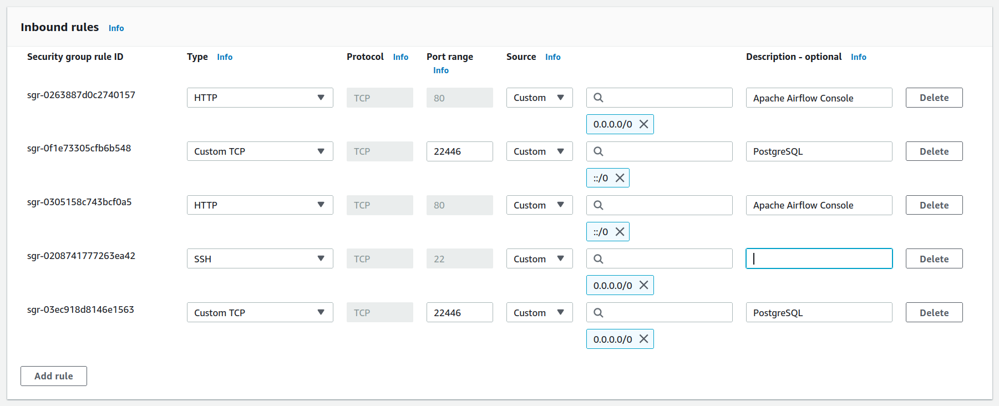

# Foundations: Data Pipeline

Data ETL pipeline to clean, process, and aggregate data from Canadian housing starts.

Built with [Apache Airflow](https://airflow.apache.org/), [dbt](https://www.getdbt.com/), and [Amazon Web Services EC2](https://aws.amazon.com/ec2/).

Learn more about the project by reading the [design document](https://docs.google.com/document/d/1zan6-rcnNHz4wdBt0fvPxRnJLioCjlaFQUfi1_0EU04/edit).

---

## Table of Contents

- [Foundations: Data Pipeline](#foundations-data-pipeline)
  - [Table of Contents](#table-of-contents)
  - [Setup Instructions](#setup-instructions)
    - [Set up AWS EC2 (Host for the Database and Orchestrator)](#set-up-aws-ec2-host-for-the-database-and-orchestrator)
      - [Provision an EC2 Instance](#provision-an-ec2-instance)
      - [Connect to the EC2 Instance using AWS CloudShell](#connect-to-the-ec2-instance-using-aws-cloudshell)
    - [Set up Docker (Containerizer)](#set-up-docker-containerizer)
    - [Set up Airflow (Orchestrator)](#set-up-airflow-orchestrator)
      - [Setup](#setup)
      - [Expose Airflow Console with the EC2 Port](#expose-airflow-console-with-the-ec2-port)
  - [Usage](#usage)
    - [Start Airflow](#start-airflow)
    - [Interact with Airflow (Local)](#interact-with-airflow-local)

<sub>Table of contents created with [VS Code Extension: Markdown All in One](https://marketplace.visualstudio.com/items?itemName=yzhang.markdown-all-in-one).
</sub>

___


## Setup Instructions

### Set up AWS EC2 (Host for the Database and Orchestrator)

#### Provision an EC2 Instance

1. Navigate to [Amazon Web Services](https://aws.amazon.com/) and create an account.
1. In the search bar at the top, search for and click **EC2**.
1. Click the **Launch Instance** button and follow the instructions. For this example, we will be using the Amazon Linux AMI operating system.
1. Download the `.pem` key file and keep it secure.
1. Wait until the instance state is **Running**.

#### Connect to the EC2 Instance using AWS CloudShell

1. In the AWS EC2 service, in the left sidebar, select **Instances**.
1. Select the newly created instance.
1. At the top of the screen, click **Connect**.
1. Choose any of the provided options to connect to the instance.

As an alternative to CloudShell, you can also use SSH from your local computer.


### Set up Docker (Containerizer)

Follow the instructions at:
1. [Installing Docker to use with the AWS SAM CLI](https://docs.aws.amazon.com/serverless-application-model/latest/developerguide/install-docker.html)
2. [Install Docker Engine](https://docs.docker.com/engine/install/)
3. [Install Docker Compose](https://docs.docker.com/compose/install/linux/#install-using-the-repository)

Ensure your user has the permissions to execute Docker:
```shell
sudo groupadd docker
sudo usermod -aG docker $USER
```

Log out and back in to get permissions.


### Set up Airflow (Orchestrator)

This section is based on the [guide for running Airflow using Docker Compose](https://airflow.apache.org/docs/apache-airflow/stable/howto/docker-compose/index.html).

#### Setup

If you are on Linux, update the Airflow UID in the `.env` file with the host user ID:
```shell
echo -e "AIRFLOW_UID=$(id -u)" > .env
```

Run database migrations and initialize the first user account:
```shell
docker compose up airflow-init
```

#### Expose Airflow Console with the EC2 Port

Follow the commands under [these instructions](https://aws.amazon.com/premiumsupport/knowledge-center/connect-http-https-ec2/) to add security group rules which permit HTTP access to port 80.

Once complete, the security rules should look like this:



---

## Usage

### Start Airflow

Start all services:
```shell
sudo docker compose up
```

`sudo` is required to run the Airflow console on port 80.  
If you want to avoid `sudo` or prefer another port:
- Open `docker-compose.yaml`
- Find the configuration for `airflow-webserver`
- Change the port number in the variable `ports`


You can stop all services with:
```shell
docker compose down
```

Airflow is now running on your machine.

### Interact with Airflow (Local)

If you set up Airflow and Docker locally, you can log into Airflow at http://localhost:80; otherwise use the port you used to expose the Airflow console.

The default username and password `airflow`; reset it immediately after logging in.

You can view information on the current environment:
```shell
docker compose run airflow-worker airflow info
OR
./bin/airflow info
```

Enter the running Docker container to execute commands:
```shell
./bin/airflow bash
```

Stop and delete all containers and volumes:
```shell
docker-compose down --volumes --rmi all
```


